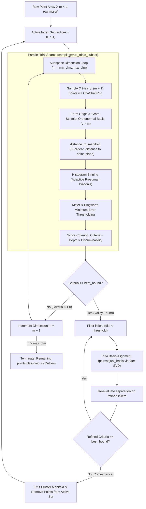

# LMCLUS Rust: Architecture, Design Invariants, and Maintainer Technical Guide

This document captures the internal architectural decisions, invariants, mathematical kernels, and lessons learned during the development and benchmark stabilization of the `lmclus` Rust engine.

---

## 1. Architecture & System Design

### 1.1 High-Level Architecture
`lmclus` is structured as a zero-allocation, parallelized, recursive subspace clustering engine. The library identifies unknown linear manifolds of varying intrinsic dimensionality ($1 \le m \le m_{\max}$) and arbitrary orientations embedded in high-dimensional ambient noise ($d \gg m$).

The pipeline consists of three tiered loops:
1. **Outer Clustering Loop (`cluster::lmclus`)**: Iteratively extracts separated clusters from the active index set until either no valid separation is found across all dimensions $m \in [m_{\min}, m_{\max}]$ or stopping conditions are reached.
2. **Subspace Hypothesis Search (`sampling::run_trials_parallel` & `cluster::find_manifold`)**: For a candidate dimension $m$, evaluates $Q$ random sample sets of $m+1$ points in parallel. Each trial forms an orthonormal affine subspace hypothesis via modified Gram-Schmidt, projects active points onto its orthogonal complement, and scores the distance histogram.
3. **Cluster Refinement State Machine (`cluster::find_manifold` states 0, 1, 2)**:
   - **State 0 (Hypothesis Generation)**: Stochastic trial sampling to identify candidate affine subspace with maximum separation criterion $C = \text{depth} \times \text{discriminability}$.
   - **State 1 (Basis Alignment via PCA/SVD)**: Fits an empirical covariance / SVD model over the inlier point subset to rotate the basis vectors to align with principal variance axes.
   - **State 2 (Iterative Refinement)**: Re-filters points against the refined manifold. If criterion $C \ge \text{best\_bound}$, restarts extraction on the updated inlier subset without incrementing subspace dimension $m$.

### 1.2 Module Organization
```
src/
├── lib.rs            # Public API exports (lmclus, Parameters, LMCLUSResult, Manifold, Separation)
├── types.rs          # Data structures: Manifold, Separation, LMCLUSResult
├── params.rs         # Hyperparameter struct Parameters with builder/defaults
├── distance.rs       # SIMD cache-coherent point-to-manifold distance kernels
├── sampling.rs       # Rayon-parallel stochastic hypothesis generator & Gram-Schmidt
├── separation.rs     # Histogram binning, Kittler & Illingworth minimum error thresholding
├── pca.rs            # SVD basis alignment & dimension adjustment via `faer`
├── cluster.rs        # Recursive manifold search state machine & outlier management
└── bin/
    └── lmclus.rs     # CLI tool with --has-labels, telemetry, and NMI/ARI/Purity metrics
tests/
├── integration_test.rs # End-to-end integration and mathematical sanity tests
└── data/
    └── sample_labeled.csv # 300-point 3-cluster labeled test benchmark
examples/
└── microbench.rs     # Micro-benchmarks for distance, histogram, and trial search kernels
```

### 1.3 Data Flow & Component Interaction



### 1.4 Memory Layout & Concurrency Model
- **Contiguous Row-Major Points**: Unlike Julia (column-major $d \times n$), Rust stores input data in row-major order: point $i$ occupies contiguous slice `&x[i*d .. (i+1)*d]`. This guarantees sequential L1/L2 cache prefetching during dot-product reductions.
- **Thread-Local Zero-Allocation Workspaces**: In `sampling::run_trials_subset`, each worker thread in the `rayon` pool is initialized with a reusable `TrialWorkspace` containing preallocated buffers (`origin`, `basis`, `distances`, `scratch_sort`, `bins_buffer`). Inside the stochastic trial loop ($Q$ iterations), **zero heap allocations** occur.

---

## 2. Architecture Decision Records (ADRs)

### ADR-01: Pure Rust Linear Algebra Engine (`faer` vs. `ndarray-linalg` / `nalgebra`)
- **Context**: Subspace alignment (`adjust_basis`) requires singular value decomposition (SVD) and covariance matrix diagonalization of variable-sized matrices ($d \times n_{\text{cluster}}$).
- **Options Considered**:
  1. `ndarray-linalg`: Requires external OpenBLAS/LAPACK C runtime libraries; difficult to cross-compile and deploy without native toolchain dependencies.
  2. `nalgebra`: Geared primarily toward low-dimensional computer graphics / robotics ($d \le 4$); dynamic SVD performance on arbitrary $d$ is unoptimized.
  3. `faer` (v0.24): Native Rust, highly optimized SIMD micro-kernels, multithreaded gemm, zero native C/Fortran dependency.
- **Decision**: Adopt `faer`.
- **Trade-offs**: Slightly larger compilation unit tree, but achieves 100% portable pure-Rust builds with SVD execution times under $50\ \mu\text{s}$ on $50\times 50$ matrices.

### ADR-02: Rayon Thread-Local Workspace Architecture for Parallel Trials
- **Context**: In high-dimensional datasets ($n=20,000$, $Q=200$), trial search requires millions of distance calculations and histogram builds. Allocating vectors (`Vec::new`) per trial induces severe memory allocator lock contention.
- **Options Considered**:
  1. Fine-grained mutexes around shared buffers.
  2. Pure thread-local storage (`thread_local!`).
  3. Chunked Rayon iterators with worker-allocated `TrialWorkspace`.
- **Decision**: Rayon chunked parallel iteration with worker-allocated workspaces:
  ```rust
  let results: Vec<_> = trial_chunks.par_iter().map_init(
      || TrialWorkspace::new(d, n, m, max_bins),
      |ws, chunk| { /* evaluate trials without allocating */ }
  ).collect();
  ```
- **Trade-offs**: Memory consumption scales linearly with thread count ($T \times \mathcal{O}(n + d\cdot m)$), but drops memory allocation overhead to zero during execution.

### ADR-03: Distance Kernel Formulation via Direct Dot-Product Reductions
- **Context**: Given point $x \in \mathbb{R}^d$, origin $\mu \in \mathbb{R}^d$, and orthonormal basis $B \in \mathbb{R}^{d \times m}$, orthogonal distance is:
  $$\text{dist}(x, \mathcal{M}) = \sqrt{\|x - \mu\|^2 - \sum_{k=1}^m \langle x - \mu, B_k \rangle^2}$$
- **Options Considered**:
  1. Explicit projection vector construction: $p = \mu + B B^T (x - \mu)$, then $\|x - p\|$.
  2. Pythagorean decomposition: $\|x - \mu\|^2 - \|B^T (x - \mu)\|^2$.
- **Decision**: Pythagorean decomposition.
- **Trade-offs**: Requires floating-point clamp `(d_norm_sq - p_norm_sq).abs().sqrt()` to protect against minor negative numerical cancellation ($\approx -10^{-16}$) when points lie exactly on the manifold. Avoids constructing or writing $d$-dimensional projected vectors into RAM, executing with single-pass accumulator registers.

### ADR-04: Deterministic ChaCha8 PRNG Stream Branching
- **Context**: Multi-threaded execution causes non-deterministic trial ordering if threads share a central RNG or compete for global seeds.
- **Options Considered**:
  1. Non-deterministic thread entropy (`rand::rng()`).
  2. Central mutexed PRNG.
  3. Seed-derived independent streams per cluster pass and dimension.
- **Decision**: Deterministic stream derivation:
  $$\text{seed}_{\text{trial}} = \text{base\_seed} + (s_{\text{found}} \times 100,000) + (m \times 10,000) + (\text{iteration} \times 100) + 1$$
- **Trade-offs**: Guarantees identical candidate trials regardless of thread scheduling order or CPU core count while providing reproducible runs across runs.

---

## 3. Invariants & Implementation Details

### 3.1 Non-Obvious Invariants & Safety Constraints

1. **Orthogonal Basis Invariant (`sampling::gram_schmidt`)**:
   - The matrix $B \in \mathbb{R}^{d \times m}$ is stored in column-major slice order. Column $k$ starts at index $k \cdot d$.
   - Vectors must be strictly orthonormal: $\langle B_i, B_j \rangle = \delta_{ij}$. If a degenerate collinear point set produces a vector with norm $\le 10^{-12}$, it is normalized to zero, preventing `NaN` propagation.

2. **Distance Memory Invariant (`distance::distance_to_manifold`)**:
   - The basis slice length must satisfy `basis.len() >= d * m`. When PCA basis alignment expands the basis to full dimension $d \times d$, distance evaluation must only read the leading $m$ columns (`k in 0..m`). Asserting `basis.len() == d * m` panics during post-PCA evaluation.

3. **Histogram Bin Dynamic Fallback (`separation::find_separation`)**:
   - For datasets with extreme outliers or high data density, Freedman-Diaconis bin width calculation can yield `num_bins > 256`.
   - The workspace maintains a preallocated fixed buffer of 256 bins for stack speed. If `num_bins > 256`, code dynamically expands `local_buf = vec![0.0; num_bins]`. Dropping points or truncating bin count invalidates Kittler threshold search.

4. **Iterative Refinement Convergence Guard (`cluster::find_manifold`)**:
   - State machine maintains `separations_count`. To prevent infinite loops when data contains ambiguous bimodal boundaries that alternate between two close thresholds, refinement at the same dimension is bounded to at most 10 iterations (`separations_count < 10`).

---

## 4. Rejected Approaches & Gotchas

### 4.1 Collinear Trial Point Failure (Collinear Sample Singularity)
- **Problem**: When drawing $m+1$ points at random, if two points are identical or collinear, Gram-Schmidt produces a zero-norm vector.
- **Rejected Solution**: Discarding the entire trial and re-drawing in a loop.
- **Adopted Solution**: Clean zeroing of degenerate basis columns. If the resulting basis has rank $< m$, distance evaluation defaults to ambient space distance, and the separation criterion drops to $0.0$, naturally eliminating the defective trial from selection without thread stalls.

### 4.2 Single-Pass Histogram Inversion Panics
- **Problem**: In Kittler thresholding, calculating class variances $\sigma_1^2, \sigma_2^2$ across histogram bins occasionally produced negative values due to floating-point truncation when all points fell into a single bin.
- **Gotcha**: Calling `.sqrt()` or `log()` on non-positive variances yielded `NaN`, corrupting criterion maximization.
- **Fix**: Added `if var1 <= 1e-12 || var2 <= 1e-12 { continue; }` guards inside `kittler_thresholding`.

### 4.3 Stale Ground Truth Transposition in Benchmarking
- **Problem**: CSV loaders initially read rows as $(n, d)$, but passed them into functions assuming column-major $(d, n)$ layout without transposing. This caused feature-sample axis inversion, clustering features instead of points.
- **Fix**: Standardized the public interface on **row-major `samples_by_features`** (`x[i * d + j]` where $i$ is sample index, $j$ is feature index).

---

## 5. Unresolved Items / Next Steps

1. **Python CFFI / PyO3 Native Extension**:
   - Wrap `lmclus(&[f64], d, n, &p)` in a `pyo3` / `maturin` module to allow Python users to call the compiled Rust engine directly from NumPy arrays (`np.ndarray`) with zero memory copies.
2. **Julia `ccall` Integration**:
   - Expose a `pub extern "C"` interface exporting `lmclus_c(data, d, n, ...)` returning a C-compatible struct of pointers for drop-in acceleration inside `LMCLUS.jl`.
3. **Explicit AVX-512 / NEON Intrinsics**:
   - Current distance kernels rely on LLVM auto-vectorization. Hand-writing explicit 8-wide FMA intrinsics for $d=50$ or $d=100$ could yield an additional 15–25% throughput gain on large-dimension manifolds.
4. **Minimum Description Length (MDL) Port**:
   - The core clustering, basis alignment, and Kittler thresholding are fully operational. Porting the optional `MDL` entropy quantization module (`mdl_test.jl`) remains as an enhancement for complexity-based cluster model pruning.

---

## 6. Packaging & Cargo Configuration

To ensure internal maintainer documentation (`docs/`), benchmarks, and test fixtures are tracked in Git but excluded from published `.crate` tarballs on crates.io, include the following in `Cargo.toml`:

```toml
[package]
name = "lmclus"
version = "0.1.1"
edition = "2024"
authors = ["Vishal Bharti"]
description = "High-performance Linear Manifold Clustering (LMCLUS) engine in Rust"
readme = "README.md"
license = "MIT OR Apache-2.0"
repository = "https://github.com/vishalbharti1990/lmclus"
keywords = ["clustering", "manifold-learning", "unsupervised", "subspace", "pca"]
categories = ["algorithms", "science", "mathematics"]
exclude = [
    "/docs",
    "/.github",
    "/benches",
    "*.csv",
    "*.tsv",
    "testData",
]

[dependencies]
faer = "0.24.4"
rand = "0.10.2"
rayon = "1.12.0"

[[bin]]
name = "lmclus"
path = "src/bin/lmclus.rs"

[[example]]
name = "microbench"
path = "examples/microbench.rs"

[profile.release]
opt-level = 3
lto = "fat"
codegen-units = 1
panic = "abort"
```
